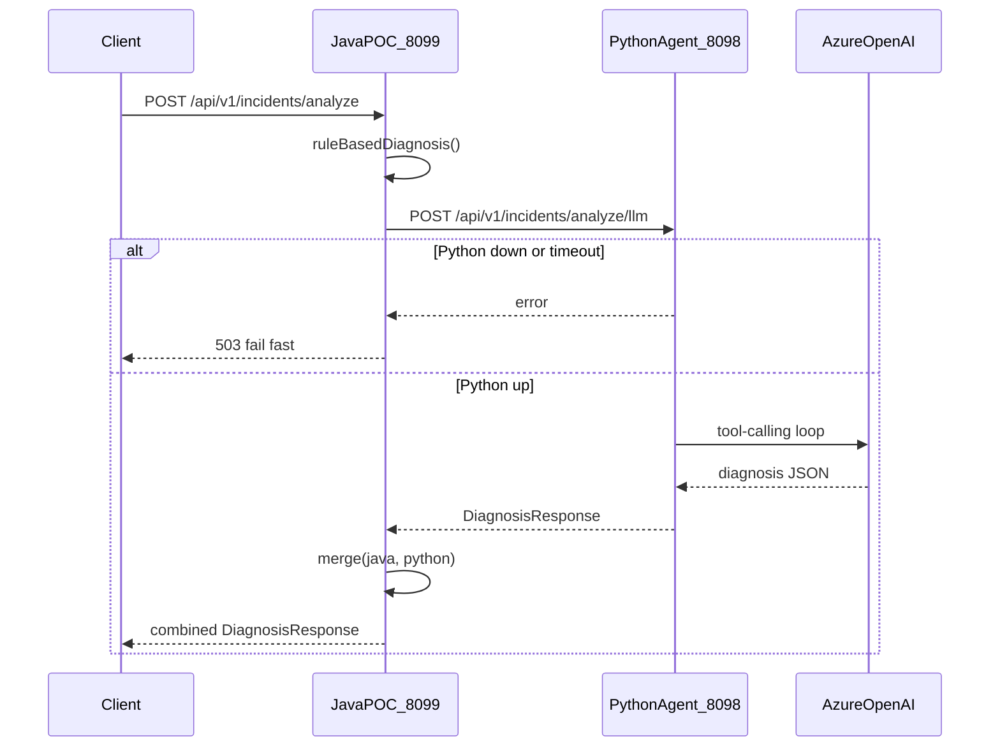

# Production Issue Resolver POC

Read-only diagnostic service for production incidents. **Java is the public API**; it runs rule-based diagnosis locally and delegates LLM reasoning to the Python agent peer.

**No auto-fix, no git writes, no deploy actions.**

## Orchestrated architecture



| Service | Port | Role |
|---------|------|------|
| Java POC (this project) | 8099 | Public API, rule-based diagnosis, orchestration, merge |
| Python agent | 8098 | Internal LLM engine (`/api/v1/incidents/analyze/llm`) |

## Stack

- Java 17
- Spring Boot 3.1.3
- Spring AI 1.0.0-M6 (Azure OpenAI)
- Gradle

## Prerequisites

- Java 17+
- Local clones of `campaign-management-service` and `ad-management-service` under `REPOS_ROOT`
- Azure OpenAI deployment (optional for rule-based fallback tests; required for LLM-powered diagnosis)

## Environment variables

| Variable | Required | Description |
|----------|----------|-------------|
| `AZURE_OPENAI_API_KEY` | For LLM | Azure OpenAI API key |
| `AZURE_OPENAI_ENDPOINT` | For LLM | e.g. `https://<resource>.openai.azure.com` |
| `AZURE_OPENAI_DEPLOYMENT` | No | Deployment name (default: `gpt-4o`) |
| `REPOS_ROOT` | No | Parent folder containing CMS/AMS repos (default: `/Users/amitasharda/Desktop/Segmentation`) |
| `POC_API_KEY` | No | If set, requests must include header `X-POC-API-KEY` |
| `PYTHON_AGENT_BASE_URL` | No | Python peer URL (default: `http://localhost:8098`) |
| `PYTHON_AGENT_ENABLED` | No | Enable orchestration (default: `true`) |

**Never commit API keys.** Use environment variables or Azure Key Vault in real deployments.

## Run locally (orchestrated)

Start **Python first** (internal LLM engine), then **Java** (public API):

```bash
# 1. Python agent (port 8098)
cd ../production-issue-resolver-agent
source .venv/bin/activate
export AZURE_OPENAI_API_KEY="your-key"
export AZURE_OPENAI_ENDPOINT="https://your-resource.openai.azure.com"
export AZURE_OPENAI_DEPLOYMENT="gpt-4o"
python run.py

# 2. Java orchestrator (port 8099)
cd ../production-issue-resolver-poc
export PYTHON_AGENT_BASE_URL="http://localhost:8098"
export POC_API_KEY="shared-key"   # optional, propagated to Python
./gradlew bootRun
```

Clients call **only Java** at `http://localhost:8099`.

### Standalone Java (no Python)

Disable orchestration to use Java rule-based fallback only:

```bash
export PYTHON_AGENT_ENABLED=false
./gradlew bootRun
```

### Standalone Java with local Azure LLM

```bash
export PYTHON_AGENT_ENABLED=false
./gradlew bootRun --args='--spring.profiles.active=llm'
```

## Run locally (legacy standalone)

## API

### POST `/api/v1/incidents/analyze`

**Golden demo — RestTemplateUtility NPE during filler-slots:**

```bash
curl -s -X POST http://localhost:8099/api/v1/incidents/analyze \
  -H "Content-Type: application/json" \
  -d '{
    "service": "ad-management-service",
    "environment": "dev",
    "apiPath": "/api/v1/campaign-ch-100/multi-channel/filler-slots",
    "httpStatus": 500,
    "errorMessage": "NullPointerException",
    "relatedServices": ["campaign-management-service"],
    "stackTrace": "java.lang.NullPointerException: Cannot invoke \"com.fasterxml.jackson.databind.JsonNode.asText()\" because the return value is null\n\tat com.tataplay.admanagement.utility.RestTemplateUtility.extractErrorMessage(RestTemplateUtility.java:48)\n\tat com.tataplay.admanagement.utility.RestTemplateUtility.handleError(RestTemplateUtility.java:32)",
    "recentLogs": "CMS returned HTTP 400 with body {\"code\":\"VALIDATION_ERROR\"}"
  }' | jq .
```

**Expected diagnosis (rule-based or LLM):**

- Root cause: CMS 400 body missing `message` field → NPE in `extractErrorMessage`
- Affected files: `RestTemplateUtility.java`, CMS `ErrorHandler.java`
- Suggested fix: null-safe JSON parsing + consistent error payload from CMS

### Optional API key

```bash
export POC_API_KEY="local-dev-key"

curl -s -X POST http://localhost:8099/api/v1/incidents/analyze \
  -H "Content-Type: application/json" \
  -H "X-POC-API-KEY: local-dev-key" \
  -d '{ ... }'
```

## Agent tools (read-only)

| Tool | Purpose |
|------|---------|
| `parseStackTrace` | Extract exception type, top frame, Caused-by chain |
| `searchCodebase` | Search indexed Java files under `REPOS_ROOT` |
| `getServiceDependencies` | Load AMS→CMS API mappings from `service-map.yml` |
| `findExceptionHandlers` | Locate `@RestControllerAdvice` classes |

## Security notes

- **Read-only**: indexes local source files only; no DB, git, or deploy access
- **Log redaction**: tokens, cookies, and JWTs stripped from `recentLogs` before LLM prompts
- **Optional endpoint auth**: set `POC_API_KEY` / `X-POC-API-KEY` for POC deployments
- **No secrets in repo**: configure Azure credentials via environment only

## Tests

```bash
./gradlew test
```

Tests disable Azure OpenAI autoconfiguration and validate:

- Stack trace parsing
- Golden RestTemplateUtility NPE rule-based diagnosis (mocked index)
- REST endpoint smoke test

## Project layout

```
src/main/java/com/tataplay/issueresolver/
  agent/IssueResolverAgent.java      # Tool-calling agent + rule-based fallback
  controller/IncidentController.java
  index/SimpleCodeIndexService.java  # In-memory class/file index
  tool/                              # Agent tools
  model/                             # Request/response DTOs
src/main/resources/
  application.yml
  service-map.yml                    # AMS→CMS API mappings
```

## Phase 2 (out of scope for POC)

- Monitoring webhooks (Datadog/Sentry)
- Vector index for similar past incidents
- Slack/Teams notifications
# production-issue-resolver-poc
